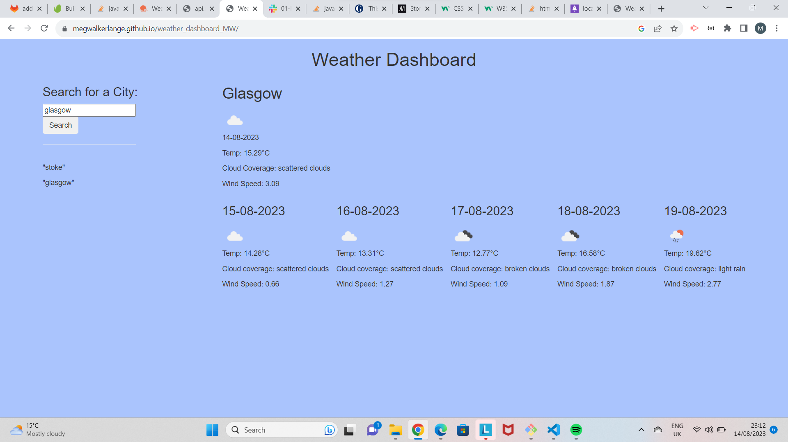

# weather_dashboard_MW

A simple app which will display the 5 day weather forecast for a location selected by the user

This app displays the weather data for the city a user has seected and typed into the search form. It will show the current weather and the forecast for the next four days. It will also log the search history. This was a useful project to learn about using API's and was a helpful project to consolidate my knowledge. I was not able to complete the styling or history features as much as I;d hope, due to time constraints, however I am pleased to have made a cpage that is clear to read. I am also aware the code I have written to create the divs to display the weather data is ver repetative and I hope to go back and refactor it, to improve my ability to write functions and algorithms.

Lines 3-10, 39 and 41 written or refactored during tutorial with Megan Meyers.

Link:

https://megwalkerlange.github.io/weather_dashboard_MW/

Screenshot:

